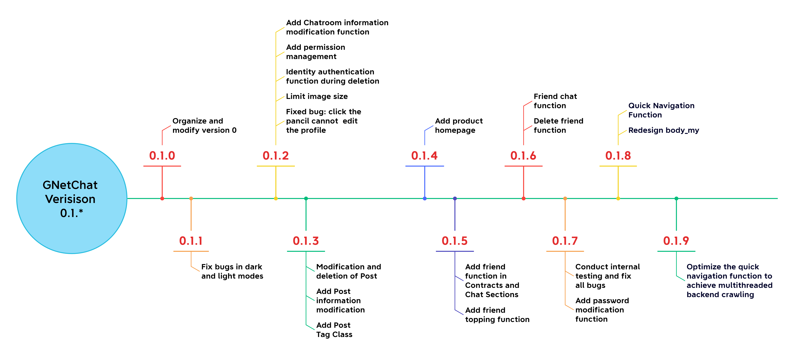
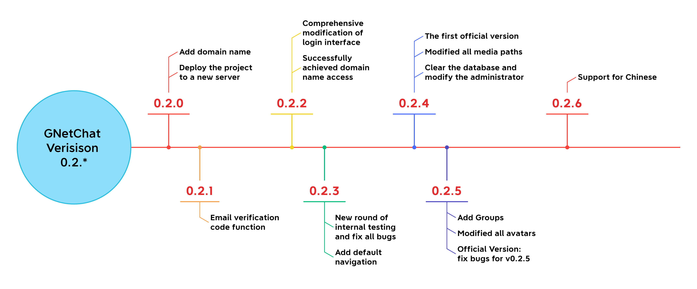

# 
GNetChat

&emsp;&emsp;GNetChat, standing as an abbreviation for **General Networking Chat**, is an innovatively designed communication platform tailored specifically to bridge the educational gap between teachers and students. This dynamic website is dedicated to streamlining the exchange of course materials, assignments, and insightful academic discussions, thereby fostering a robust educational environment. It facilitates not only the direct communication and feedback loop between educators and learners but also encourages vibrant group collaborations and resource sharing among classmates. With GNetChat, students can easily form study groups, share essential resources, and collaborate on projects in real-time, making it an indispensable tool for modern education. Its intuitive interface and comprehensive features aim to enhance learning outcomes and promote a more engaged and interactive academic community.

## What does GNetChat support?

|Module|content1|Impl.|content2|Impl.|content3|Impl.|content4|Impl.|
| :---: |:--:|:---:|:---:|:---:| :--: |:---:| :--: |:---:|
| Home Page | introduction | ✔ | previews | ✔ | developers | ✔ | -- | -- |
|  Log  | log in| ✔ | create account | ✔ | email verification | ✔ | -- | -- |
|  Profile  | quick guide | ✔ | profile | ✔ | -- | -- | -- | -- |
|  Chat  | top friends | ✔ | live chat | ✔ | file(img) sending | ✔ | -- | -- |
|  Groups  | create / delete / join | ✔ | live chat | ✔ |file(img) sending | ✔ | -- | -- |
|  Chatroom  | create / delete / join / edit  | ✔ | post | ✔ | live chat | ✔ | file(img) sending | ✔ |
|  Contacts | add friends | ✔ | delete friends | ✔ | -- | -- | -- | -- |
|  Settings | modify profile | ✔ | modify password | ✔ | -- | -- | -- | -- |
|  Others | light/dark mode | ✔ | log out | ✔ | -- | -- | -- | -- |

## Preview

#### post

#### dark mode

## Developing Versions

#### version v0.0.*

#### version v0.1.*

#### version v0.2.*

